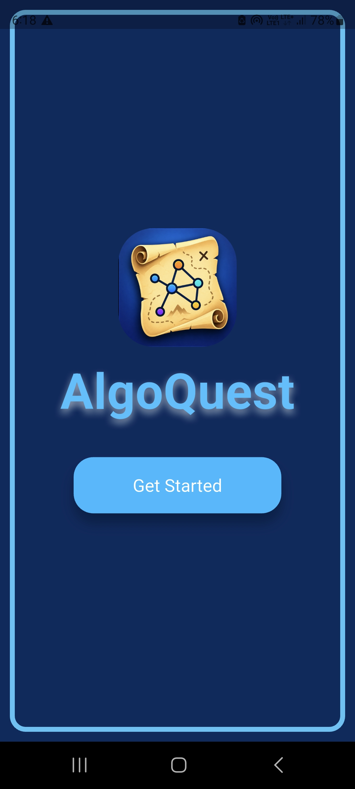
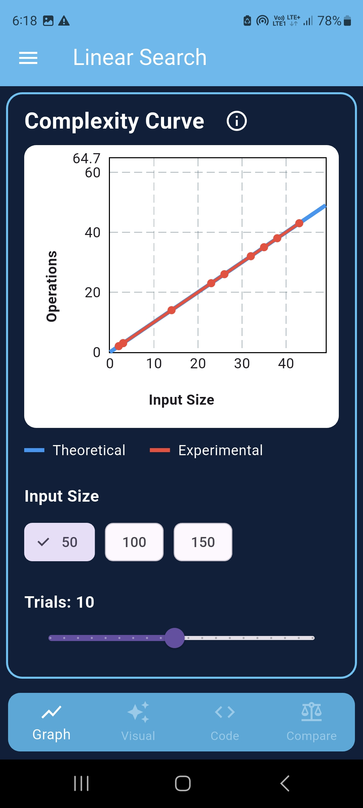
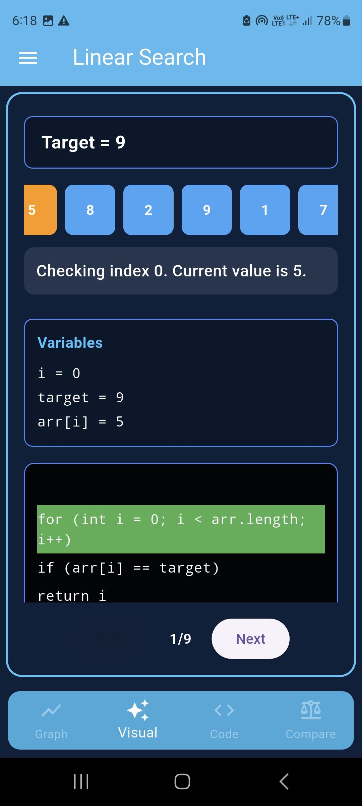
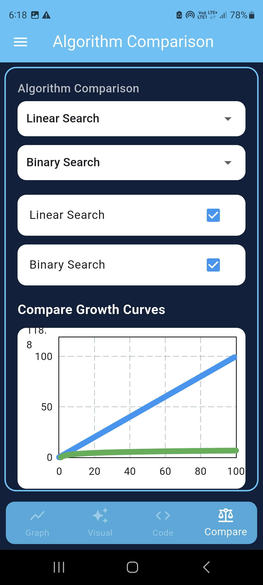

# 🚀 Algorithm Playground

Algorithm Playground is a Flutter application designed to help users learn, visualize, and compare algorithms through interactive graphs, code examples, and performance analysis.

The goal of the project is to make algorithm learning more intuitive by combining theoretical complexity with practical execution behavior.

---

## ✨ Features

### 📈 Algorithm Complexity Graphs
- Visualize algorithm growth rates
- Compare theoretical time complexities
- Interactive graph scaling
- Multiple algorithm support

### 🔍 Algorithm Explorer
- Learn how algorithms work
- View algorithm information in a structured format
- Understand best, average, and worst-case complexities

### 💻 Code Reference
- View algorithm implementations
- Clean and beginner-friendly code examples
- Easy comparison between different approaches

### ⚖️ Algorithm Comparison
- Compare multiple algorithms side-by-side
- Visual performance comparison
- Understand trade-offs between algorithms

### 📱 Mobile Friendly
- Built entirely with Flutter
- Responsive UI
- Smooth navigation experience

---

## 🧠 Currently Supported Algorithms

- Linear Search
- Binary Search
- Bubble Sort
- Selection Sort

### Planned Additions

- Insertion Sort
- Merge Sort
- Quick Sort
- BFS (Breadth-First Search)
- DFS (Depth-First Search)
- Dijkstra's Algorithm
- More algorithms in future updates

---

## 🏗️ Project Structure

```text
lib/
│
├── main.dart
│
├── core/
│   └── constants/
│       └── colors.dart
│
├── screens/
│   ├── start_screen.dart
│   └── home_screen.dart
│
├── pages/
│   ├── graph_page.dart
│   ├── visual_page.dart
│   ├── code_page.dart
│   └── compare_page.dart
│
├── algorithms/
│   ├── linear_search.dart
│   └── binary_search.dart
│
└── data/
    ├── algorithm.dart
    └── algorithm_registry.dart
```

---

## 🛠️ Built With

- Flutter
- Dart
- fl_chart


---

## 🎯 Purpose

Many learners memorize Big-O notation without understanding what it actually means in practice.

Algorithm Playground aims to bridge that gap by:

- Showing algorithm behavior visually
- Comparing growth rates interactively
- Connecting theory with practical observations
- Providing an approachable learning experience for beginners

---

## 🚀 Getting Started

### Prerequisites

- Flutter SDK
- Dart SDK
- Android Studio or VS Code

### Installation

```bash
git clone https://github.com/your-username/algorithm-playground.git
```

```bash
cd algorithm-playground
```

```bash
flutter pub get
```

```bash
flutter run
```

---

## 📸 Screenshots

### Home Screen


### Graph View


### Algorithm Details


### Comparison Page


---

## 🔮 Future Improvements

- More algorithms
- Interactive algorithm animations
- Custom input testing
- Experimental runtime benchmarking
- Dark mode
- Complexity quiz mode
- Algorithm challenge section

---

## 🤝 Contributions

Contributions, suggestions, and feedback are welcome.

Feel free to fork the project and submit a pull request.

---

## 📄 License

This project is open-source and available under the MIT License.

---

### Created by Vishal V

A Flutter project built to make algorithm learning more visual, interactive, and beginner-friendly.
